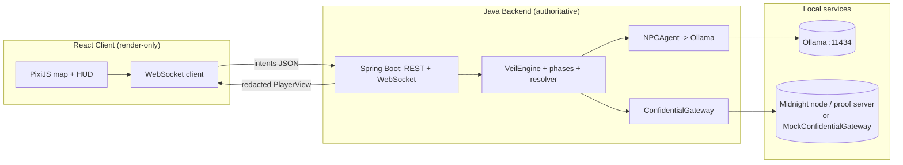
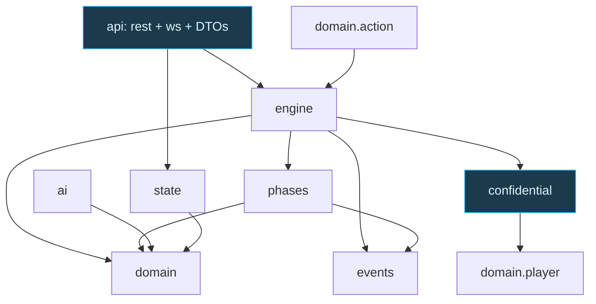
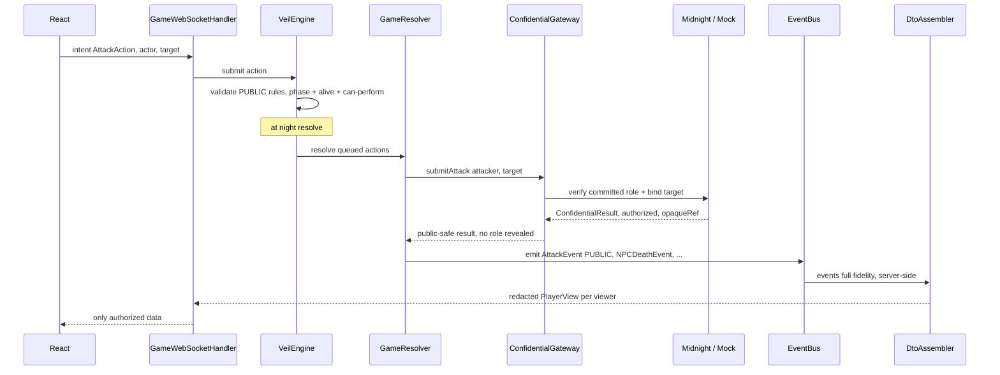
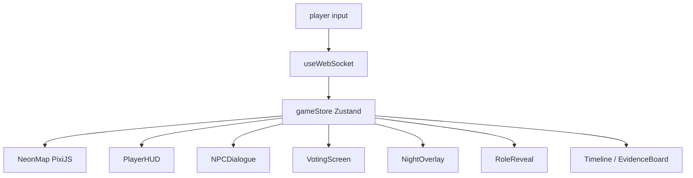

# Veil Protocol — Production Architecture (v2)

How to extend the existing Java engine into a full local-first stack:
**Java (authoritative) + React (render-only) + Ollama (NPC dialogue) + Midnight (confidential state)**.

> This document does **not** rewrite the engine. Everything under `game-engine/` stays. v2 adds
> *layers around it*: a Spring Boot transport, a confidential gateway seam, and a React client.

---

## 1. Guiding principles

1. **Java is the single source of truth.** All simulation, timers, resolution, and public state.
2. **Frontend only renders.** It sends intents, receives redacted views, and animates. No rules.
3. **Midnight owns confidential state only.** Roles, night-action authorization, investigation
   results, win verification — reached exclusively through one gateway interface.
4. **Confidential data never reaches a client unless that client is authorized** — enforced by the
   existing redaction boundary (`api/DTOs/DtoAssembler`) plus per-event visibility.

---

## 2. System context



The browser never talks to Ollama or Midnight directly — only to Java.

---

## 3. Extended folder / package structure

Existing modules are unchanged; **bold** entries are new in v2.

```
veil-protocol/
├── game-engine/                      # Java 21 — authoritative simulation (EXISTS)
│   └── src/main/java/com/veil/
│       ├── engine/                   # VeilEngine, GameContext, GameResolver (EXISTS)
│       ├── domain/                   # player, roles(Strategy), npc, world, action(Command) (EXISTS)
│       ├── phases/                   # State pattern: Lobby/Night/Day/Voting/Result (EXISTS*)
│       ├── events/                   # Observer: EventBus + events (EXISTS)
│       ├── state/                    # PublicState / PrivateState (EXISTS)
│       ├── ai/                       # NPCAgent, PromptBuilder, OllamaClient (EXISTS)
│       ├── confidential/  **NEW**    # ConfidentialGateway, MockConfidentialGateway, MidnightConfidentialGateway
│       └── api/
│           ├── DTOs/                 # DtoAssembler = redaction boundary (EXISTS)
│           ├── rest/      **NEW**    # GameController (create/join/start)
│           ├── ws/        **NEW**    # GameWebSocketHandler, WsSessionRegistry, EventToWsBridge
│           └── config/    **NEW**    # WebSocketConfig, OllamaConfig, MidnightConfig
│
├── frontend/                         # React + TS + Vite + Tailwind + Framer + PixiJS (EXISTS scaffold)
│   └── src/
│       ├── app/                      # router, providers
│       ├── api/                      # gameClient.ts (REST), ws transport
│       ├── stores/                   # gameStore.ts (Zustand) — mirrors PlayerView
│       ├── hooks/                    # useWebSocket, useGameState, useMidnight
│       ├── components/{city,game,npc,ui}/   # Map, HUD, NPCDialogue, RoleReveal, Voting, NightOverlay...
│       └── types/                    # Player, Location, Event (generated from shared/schemas)
│
├── midnight-contracts/               # Compact contracts + runnable ZK demo (EXISTS)
├── shared/                           # JSON schemas + Roles.ts — the wire contract (EXISTS)
├── docker-compose.yml                # ollama + midnight proof server + (optionally) backend
└── docs/
```

\* `phases/` currently has Night/Day/Voting; add `LobbyPhase` and `ResultPhase` for the full
Lobby → Night → Day → Voting → Result loop (small additions, same State-pattern shape).

---

## 4. Where each component belongs

| Component / concern | Lives in | Notes |
|---|---|---|
| Player movement, map, timers, voting tally, chat | `game-engine` (public state) | already authoritative |
| Roles (behavior) | `domain/roles` (Strategy) | `Player HAS-A RoleStrategy`, no subclasses |
| Roles (secret identity), night-action auth, investigation, win check | `confidential/` → Midnight | via `ConfidentialGateway` |
| Actions | `domain/action` (Command) | add `VoteAction` for uniformity |
| Phases | `phases/` (State) | add `LobbyPhase`, `ResultPhase` |
| Events | `events/` (Observer) | see event mapping below |
| NPC memory + personality + trust | `domain/npc` | facts are deterministic |
| NPC dialogue phrasing | `ai/` → Ollama | flavor only; never invents facts |
| Transport (REST/WS) | `api/rest`, `api/ws` | thin; calls engine, serializes DTOs |
| Redaction | `api/DTOs/DtoAssembler` | the ONLY reader of private state |
| Rendering, animation, input | `frontend/` | zero rules |

**Event mapping** (spec name → engine class): `PlayerMovedEvent`✓, `AttackEvent`✓,
`NPCKilledEvent`→`NPCDeathEvent`, `InvestigationEvent`→`EvidenceEvent`,
`ShieldEvent`→**add**, `GameWonEvent`→**add**. All extend `GameEvent` and carry a `Visibility`.

---

## 5. Dependency graph (backend)



**Rule:** dependencies point inward — `api → engine → domain`. `domain` imports nothing outward.
Only `api/DTOs` reads `state.PrivateState`. Only `confidential` and `api` are new import targets.

---

## 6. The Java ↔ Midnight seam (the crux)

The engine talks to Midnight through **one interface** — already added and compiling:

```java
// game-engine/src/main/java/com/veil/confidential/ConfidentialGateway.java
public interface ConfidentialGateway {
    String commitRole(String playerId, Role role);
    String commitmentOf(String playerId);
    Faction investigate(String oracleId, String targetId);
    ConfidentialResult submitAttack(String attackerId, String targetId);
    boolean verifyWin(Faction faction);
}
```

- `MockConfidentialGateway` (added) runs everything in-process with SHA-256 commitments — so the
  whole stack works locally **with no Midnight node**.
- `MidnightConfidentialGateway` (to add) implements the same methods by calling the Midnight
  proof server / `midnight.js` and the deployed Compact circuits in `midnight-contracts/`.

Swapping them is a one-line wiring change (a Spring `@Bean` / profile) — no game logic changes.

### Confidential action flow (matches your spec)



Key point: the **result** crossing back is public-safe (`authorized` + `opaqueRef`), so Java can
update public state and the frontend can render — without any secret ever leaving the gateway.

---

## 7. Transport layer (Spring Boot) — added around the engine

Keep it thin; it never contains rules.

- `api/config/WebSocketConfig` — registers `GameWebSocketHandler` at `/ws/game`.
- `api/ws/GameWebSocketHandler` — parses intent JSON → builds a `GameAction`/vote → `engine.submit(...)`.
- `api/ws/EventToWsBridge` — registers as a `GameEventListener`; on each event, asks `DtoAssembler`
  for each connected viewer's `PlayerView` and pushes it (this is the existing `WebSocketHandler`
  logic, now backed by real sockets).
- `api/rest/GameController` — `POST /games`, `POST /games/{id}/join`, `POST /games/{id}/start`.
- One `VeilEngine` **per match**, single-writer (an actor/executor) → deterministic, lock-free.

`pom.xml` adds `spring-boot-starter-web` + `spring-boot-starter-websocket` (Java 21). The engine
`pom` stays zero-dep; Spring lives in the `api` layer only.

---

## 8. Frontend architecture (render-only)



- **Transport**: `api/ws` receives `PlayerView` snapshots + event deltas → writes to `gameStore`.
- **State**: `gameStore` is a direct mirror of the server's `PlayerView`. The client renders
  whatever it's given; it cannot compute or infer secrets it wasn't sent.
- **Rendering**: PixiJS for the animated neon `NeonMap` (WebGL, many sprites); React + Tailwind +
  Framer Motion for glassmorphic HUD, holographic panels, `NightOverlay`, `RoleReveal` transitions.
- **Types**: generate `types/*` from `shared/schemas/*.json` so wire contracts can't drift.

Component homes (already scaffolded): `components/city/` (NeonMap, LocationNode, PlayerMarker),
`components/game/` (RoleReveal, NightPhase, DayPhase, VotingPanel), `components/npc/`
(NPCDialogue, MemoryViewer), `components/ui/` (Terminal, HologramCard).

---

## 9. Data classification (enforced, not aspirational)

| PUBLIC (in Java, broadcast) | CONFIDENTIAL (Midnight gateway, redacted) |
|---|---|
| map, positions, movement | player roles, mafia identities |
| chat, lobby, timers | night actions (attack/shield/investigate) |
| voting results, public events | investigation results, shield targets |
| animations | hidden evidence, NPC private memories |
| — | win verification |

Enforcement: confidential values have **no field** in `PlayerView`; events carry `Visibility`
and `isVisibleTo(viewer)`; `DtoAssembler` is the only code path from `PrivateState` to the wire.

---

## 10. Run everything locally

**Prereqs:** JDK 21, Maven, Node ≥ 20, Ollama, (optional) Docker for a Midnight node.

```bash
# 1. Ollama (NPC dialogue)
ollama serve &          # http://localhost:11434
ollama pull llama3

# 2. Midnight — choose ONE
#    (a) no node needed: backend uses MockConfidentialGateway (default profile "local")
#    (b) real node: docker compose up midnight-proof-server   # wire into docker-compose.yml

# 3. Backend (authoritative)
cd game-engine && mvn spring-boot:run     # REST :8080, WS ws://localhost:8080/ws/game
#    (today, before Spring is added: `mvn -q compile && java -cp target/classes com.veil.Demo`)

# 4. Frontend
cd frontend && npm install && npm run dev  # http://localhost:5173  (Vite proxies /ws -> :8080)
```

**Wiring summary:**
- Frontend `.env`: `VITE_WS_URL=ws://localhost:8080/ws/game`.
- Backend `application.yml`: `veil.confidential.mode: mock|midnight`, `veil.ollama.url`,
  `veil.midnight.url`.
- Selecting the gateway: a Spring `@Profile("local")` provides `MockConfidentialGateway`;
  `@Profile("midnight")` provides `MidnightConfidentialGateway`. Same interface either way.

---

## 11. Suggested next steps (incremental, low-risk)

1. Add `LobbyPhase` + `ResultPhase` and a `VoteAction` (round out State/Command sets).
2. Add `ShieldEvent` + `GameWonEvent`; rename-map the rest in DTOs.
3. Introduce the Spring Boot `api/` layer wrapping the existing engine (no engine changes).
4. Wire `ConfidentialGateway` into `GameResolver` for attack/investigate/win.
5. Build the React transport + `gameStore`, then the `NeonMap` and HUD.
6. Implement `MidnightConfidentialGateway` against the Compact circuits; flip the profile.

Each step preserves existing behavior and is independently testable.
