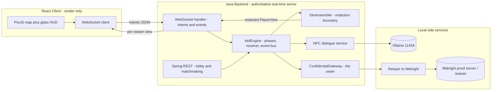
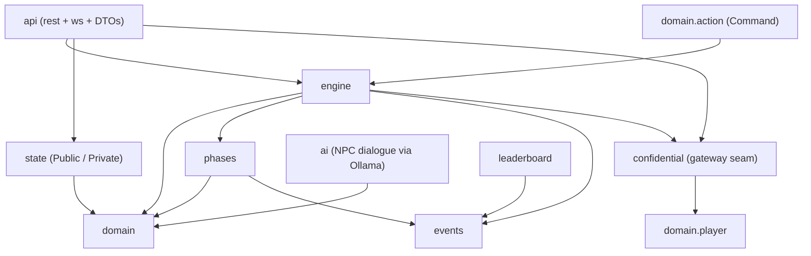
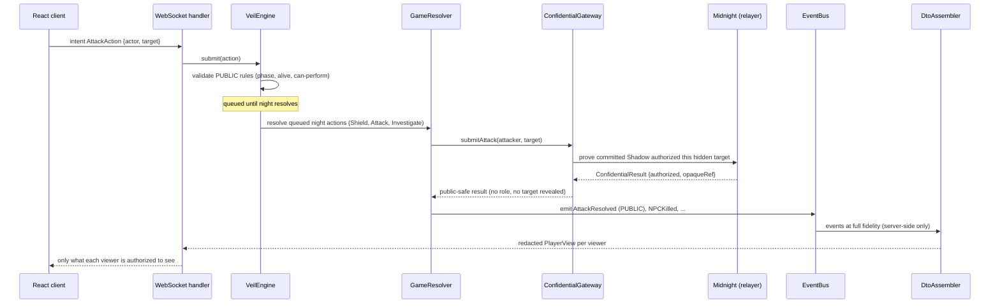
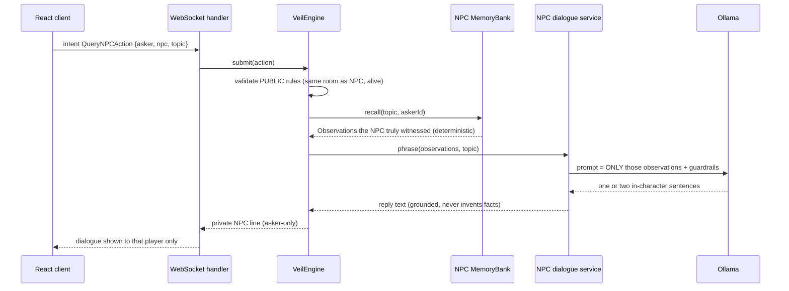
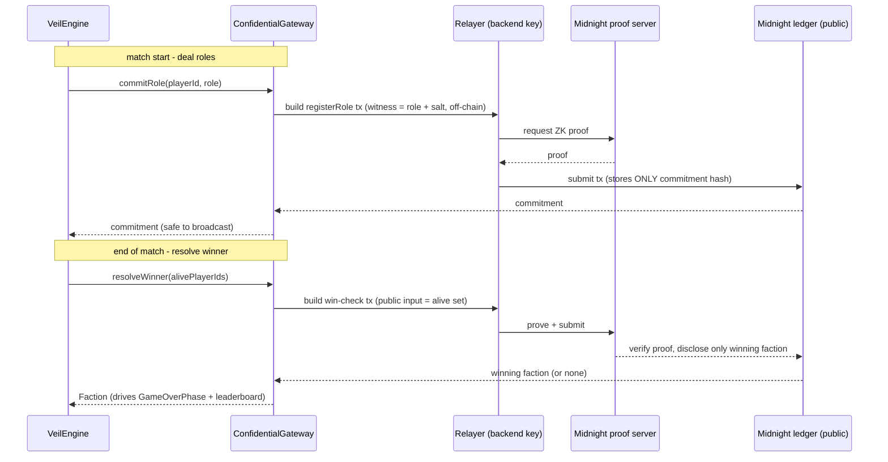
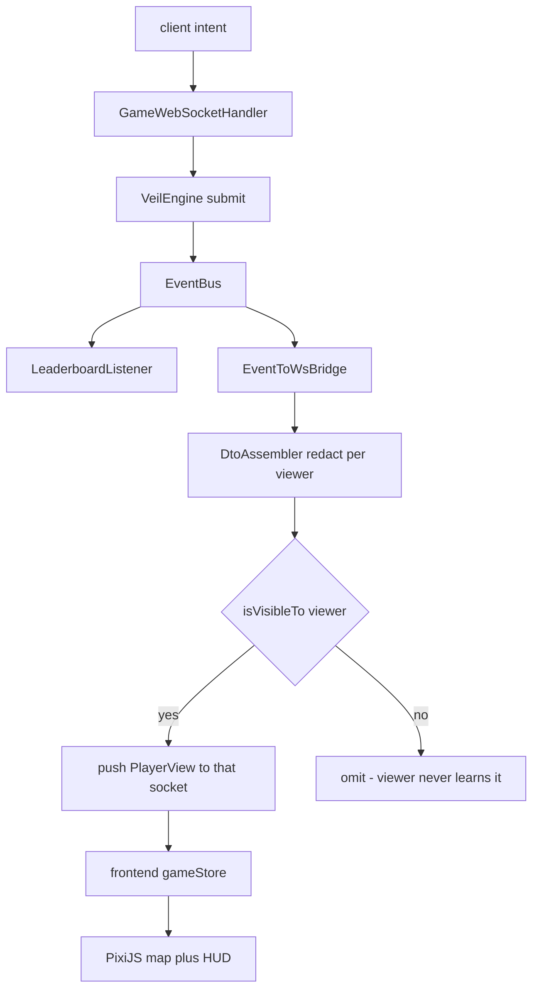
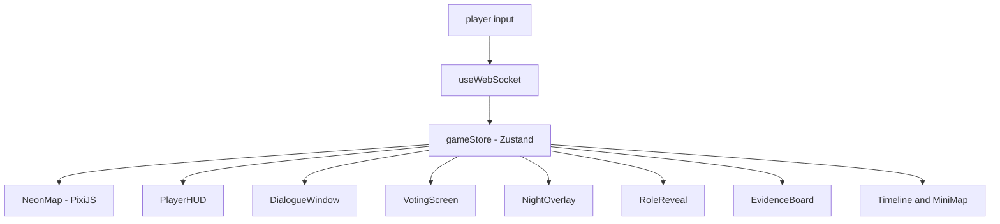

# Veil Protocol — Architecture (v3, FINAL)

This is the authoritative architecture for Veil Protocol. It supersedes `architecture.md`
and `architecture-v2.md` (kept for history). The decision is fixed: a **HYBRID** system.

> **We do NOT put the whole game on Midnight.** Java is the authoritative real-time server.
> Midnight is the **confidential referee** for secret state only. The React client renders;
> it never runs rules. Ollama only phrases what an NPC actually witnessed.

---

## 1. Guiding principles

1. **Java is the single source of truth for PUBLIC state** — simulation, movement,
   pathfinding, NPCs, lobby/matchmaking, timers, proximity chat, event streaming.
2. **Midnight owns CONFIDENTIAL state only** — role assignment, hidden identities, night
   actions, attack/shield/investigation resolution, vote & win verification, hidden evidence
   and witness status. Reached through exactly one seam: `ConfidentialGateway`.
3. **The frontend only renders.** It sends intents, receives per-viewer redacted views, and
   animates. It cannot compute or infer a secret it was not explicitly sent.
4. **Confidential data never reaches a client unless that client is authorized** — enforced
   by the redaction boundary (`api/DTOs/DtoAssembler`) plus per-event `Visibility`.
5. **Relayer wallet model.** Players do not connect wallets; the backend submits Midnight
   transactions on their behalf. The seam is designed so a per-player wallet can replace the
   relayer later with no game-logic change.

---

## 2. High-level architecture



The browser never talks to Ollama or Midnight directly — only to Java. Java is the only
component that ever holds a raw secret in memory, and only long enough to hand it to the
gateway; the gateway returns public-safe results (a commitment, a faction bit, authorized
yes/no, an opaque reference).

---

## 3. Package diagram (backend)

Dependencies point inward: `api -> engine -> domain`. `domain` imports nothing outward.
Only `api/DTOs` reads `state.PrivateState`. Only `confidential` and `api` reach outside.



| Package | Role | Key pattern |
|---|---|---|
| `domain.player` | Player, Role, Faction, PlayerStatus | Player HAS-A `RoleStrategy` |
| `domain.roles` | ShadowRole, OracleRole, AegisRole, CitizenRole | **Strategy** |
| `domain.action` | Attack/Move/Shield/Investigate/Vote/QueryNPC | **Command** |
| `domain.npc` | NPC, MemoryBank, Observation, Personality, TrustScore | witness model |
| `domain.world` | City, Location, Room, Position | graph + rooms |
| `phases` | Lobby/Night/Day/Voting/GameOver | **State** |
| `events` | EventBus + PlayerMoved/AttackResolved/... | **Observer** |
| `state` | PublicState / PrivateState | data classification |
| `engine` | VeilEngine, GameContext, GameResolver | orchestration |
| `confidential` | ConfidentialGateway + Mock/Midnight impls | the seam |
| `ai` | NPC dialogue service (Ollama) | flavor only, never authoritative |
| `api` | rest + ws + DTOs (redaction) | thin transport |
| `leaderboard` | cross-match standings | Observer listener |

---

## 4. Data classification (enforced, not aspirational)

| PUBLIC — in Java, broadcast | CONFIDENTIAL — Midnight via gateway, redacted |
|---|---|
| map, positions, movement, pathfinding | player roles, Shadow identities |
| lobby, matchmaking, room codes, timers | night actions (attack / shield / investigate) |
| proximity & channel chat, votes cast | attack targets, shield targets |
| visible NPCs, public events, animations | investigation results |
| anonymous district head-counts | hidden evidence ownership, hidden witness status |
| — | vote verification, win verification |

Enforcement: confidential values have **no field** in `PlayerView`; events carry a
`Visibility` and an `isVisibleTo(viewer)` check; `DtoAssembler` is the only code path from
`PrivateState` to the wire.

---

## 5. Core interfaces (the seams)

These interfaces are the architecture. Implementations swap behind them without touching
callers.

### 5.1 Confidential referee (the Midnight seam + relayer)

```java
// backend: com.veil.confidential.ConfidentialGateway
public interface ConfidentialGateway {
    String commitRole(String playerId, Role role);          // returns only a commitment hash
    String commitmentOf(String playerId);
    Faction investigate(String oracleId, String targetId);  // returns only a faction bit
    ConfidentialResult submitAttack(String attackerId, String targetId); // authorized + opaqueRef
    boolean verifyWin(Faction faction);
    Faction resolveWinner(Set<String> alivePlayerIds);       // discloses only the winning faction
}
```

- `MockConfidentialGateway` — in-process SHA-256 commitments; the whole stack runs with no
  Midnight node (default `local` profile). Used for dev, tests, and offline demos.
- `MidnightConfidentialGateway` (Phase 4) — the **relayer**: implements the same methods by
  submitting Compact circuit transactions to the Midnight proof server and reading back only
  the disclosed ledger facts. Selected via the `midnight` Spring profile.

**Why an interface + relayer, not direct on-chain calls in the engine?** It keeps the engine
deterministic and testable offline, isolates all network/ZK latency to one place, and makes
the relayer -> player-wallet migration a single-class change.

### 5.2 Role behavior — Strategy

```java
// com.veil.domain.roles.RoleStrategy
public interface RoleStrategy {
    Role role();
    boolean canPerform(GameAction action, GameContext ctx);  // night-power legality
}
// Player HAS-A RoleStrategy — never `class ShadowPlayer extends Player`.
```

### 5.3 Player actions — Command

```java
// com.veil.domain.action.GameAction
public interface GameAction {
    String actorId();
    boolean validate(GameContext ctx);   // PUBLIC legality (phase, alive, adjacency, ...)
    void execute(GameContext ctx);        // mutate state / queue for night resolution
}
// AttackAction, MoveAction, ShieldAction, InvestigateAction, VoteAction, QueryNPCAction.
```

### 5.4 Phases — State

```java
// com.veil.phases.GamePhase
public interface GamePhase {
    GamePhaseType type();       // LOBBY, NIGHT, DAY, VOTING, GAME_OVER
    void onEnter(GameContext ctx);
    void onExit(GameContext ctx);
    GamePhase next(GameContext ctx);
}
```

### 5.5 Events — Observer

```java
// com.veil.events.GameEventListener
public interface GameEventListener { void onEvent(GameEvent event); }
// EventBus fans out: PlayerMoved, AttackResolved, VoteCast, NPCKilled, EvidenceFound,
// RoleRevealed — each carries a Visibility so DtoAssembler can redact per viewer.
```

### 5.6 Lobby / matchmaking (Phase 2 — new for multiplayer humans)

```java
// com.veil.api.session.RoomRegistry
public interface RoomRegistry {
    GameSession createRoom(String hostPlayerId);   // returns a session with a short room code
    GameSession joinRoom(String roomCode, String playerId, String displayName);
    GameSession startRoom(String roomCode, String hostPlayerId);
    GameSession byCode(String roomCode);
}
```

**Why room codes over a global matchmaker?** Zero infrastructure, instant "play with
friends" demo UX, and it maps cleanly onto one `VeilEngine` per room (single-writer,
deterministic). A ranked matchmaker can be layered on later behind the same interface.

---

## 6. Data flow — confidential night action

Player intent -> Java validates PUBLIC rules -> if confidential, through the gateway
(relayer -> Midnight) -> Java updates PUBLIC state -> redacted event to clients.



The result crossing back is public-safe, so Java can update public state and the client can
render — without any secret leaving the gateway.

---

## 7. Data flow — NPC interaction (Ollama phrases stored memory)

The engine decides the **facts** (what the NPC actually witnessed, scoped by the asker);
Ollama only **phrases** them. Identical questions yield identical facts -> identical answers.
Ollama never sees whole game state and can never invent, accuse, or reveal a role.



---

## 8. Data flow — Midnight interaction (relayer lifecycle)



---

## 9. WebSocket event flow (public state to clients)

One `VeilEngine` per room, single-writer. Every state change emits a `GameEvent`; the bridge
asks `DtoAssembler` for each connected viewer's authorized `PlayerView` and pushes it.



Event catalog: `PlayerMoved`, `AttackResolved`, `VoteCast`, `NPCKilled`, `EvidenceFound`,
`RoleRevealed` (each with a `Visibility`).

---

## 10. Frontend architecture (render-only)



- **Transport**: `api/ws` receives `PlayerView` snapshots + event deltas -> writes `gameStore`.
- **State**: `gameStore` mirrors the server's `PlayerView`; the client renders what it is given.
- **Rendering**: PixiJS for the animated neon map (WebGL); React + Tailwind + Framer Motion
  for the glassmorphic HUD, holographic panels, `NightOverlay`, and `RoleReveal` transitions.
- **Theme**: cyberpunk (Blade Runner / Ghost in the Shell / Minority Report) — glassmorphism,
  neon lighting, animated holograms, dark UI.
- **Types**: generated from `shared/schemas/*.json` so the wire contract cannot drift.

---

## 11. Incremental build plan (each phase compiles before the next)

| Phase | Deliverable | Exit criteria |
|---|---|---|
| **1. Foundation** | Monorepo layout (`backend/ frontend/ midnight/ shared/ docs/ tests/`), dependencies, this architecture, interface catalog | `mvn compile` + `tsc` pass |
| **2. Backend engine** | Room-code lobby/matchmaking (`RoomRegistry`), remove AI **operatives** (keep NPC AI), add `VoteAction` + `GameOverPhase`, wire gateway into resolver | full Lobby->GameOver loop runs on mock gateway; tests green |
| **3. Frontend** | Join-by-room-code lobby, render-only store, WS transport, base HUD/map | client plays a match end to end against the backend |
| **4. Midnight integration** | `MidnightConfidentialGateway` relayer against the Compact circuits; `midnight` profile | flipping the profile keeps behavior identical; roles verified on-chain |
| **5. NPC AI** | Memory-scoped Ollama prompts; deterministic answers to identical questions | same question -> same facts; model offline still playable |
| **6. Animations** | PixiJS neon map, glassmorphic HUD, NightOverlay, RoleReveal, holograms | 60fps map, polished transitions |
| **7. Testing** | Unit + integration + e2e in `tests/` | redaction never leaks; full-loop e2e green in CI |

### Why hybrid, and why these boundaries

- **Midnight cannot run a real-time simulation.** Compact contracts are transaction-driven ZK
  circuits + a public ledger; they cannot host 45s timers, live movement, pathfinding, or
  proximity chat. Forcing those on-chain would break the game feel. So real-time simulation
  stays in Java and only the genuinely **confidential, must-be-trustless** decisions go to
  Midnight — which is exactly what a "referee" does.
- **One gateway interface** keeps the engine free of ZK/network concerns, testable offline via
  the mock, and swappable to real Midnight (and later to player wallets) without touching
  game logic — a direct application of Dependency Inversion.
- **Render-only client** guarantees confidentiality by construction: a secret with no field in
  `PlayerView` and no visible event simply cannot reach an unauthorized player.
