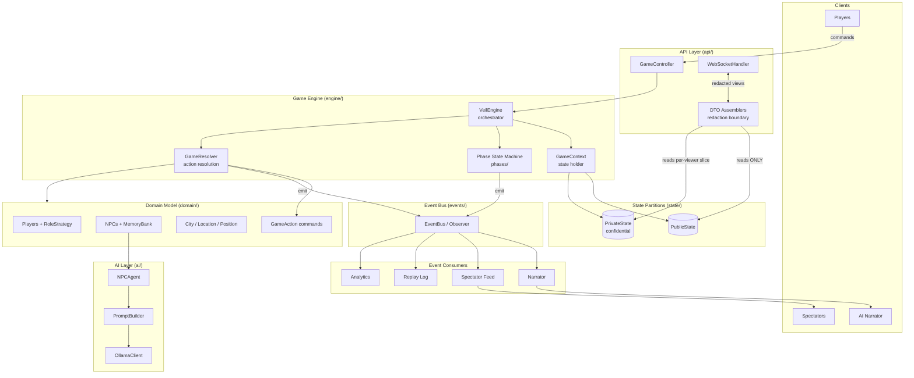
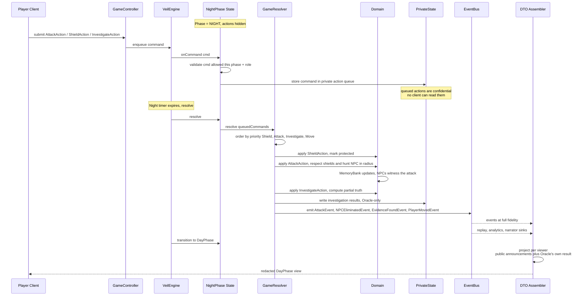

# Veil Protocol: Neon City — Backend Architecture

A confidential-information social-deduction simulation. The central design constraint is a
**hard boundary between public state and confidential state**: normal game systems must be
*structurally incapable* of leaking roles, NPC memories, private actions, or hidden locations.

---

## 1. High-Level Architecture



**Key idea:** the engine mutates `PrivateState` freely, but everything that reaches a client is
funneled through a single **redaction boundary** (the DTO assemblers). Clients never receive
domain objects — only view DTOs projected for a specific viewer.

---

## 2. Main Domain Objects and Responsibilities

### Players & Roles (Strategy)
| Object | Responsibility |
|---|---|
| `Player` | Identity, position, `PlayerStatus`, and a reference to a `RoleStrategy`. Holds *no* role-specific logic. |
| `RoleStrategy` | Interface defining role behavior: `availableActions(ctx)`, `canAct(phase)`, `faction()`. |
| `ShadowRole` | Can emit `AttackAction` (players) and hunt/eliminate NPC witnesses within radius. |
| `OracleRole` | Can emit `InvestigateAction` / `QueryNPCAction`; receives partial-truth results. |
| `AegisRole` | Can emit `ShieldAction` on a player or NPC for the night. |
| `CitizenRole` | Movement + voting only; no night power. |
| `PlayerStatus` | Alive / dead / protected / silenced — public-safe status flags. |

### NPCs (Knowledge, not chatbots)
| Object | Responsibility |
|---|---|
| `NPC` | A witness entity with a `Personality`, a `MemoryBank`, trust relationships, and a location. |
| `Personality` | Traits (e.g., cautious, talkative, loyal) that shape *how* known info is phrased/gated. |
| `MemoryBank` | Ordered, immutable `Observation` records. The **only** knowledge source an NPC can draw from. |
| `Observation` | A witnessed fact: `(subject, action, location, tick, confidence)`. |

> NPCs never lie: an answer is derived **only** from `MemoryBank` + `Personality`. Two players
> asking the same question get consistent answers because the answer is a pure function of
> `(memories, personality, question)` — not of live global state.

### World
| Object | Responsibility |
|---|---|
| `City` | Graph of `Location`s; adjacency + movement rules; radius queries for Shadow hunting. |
| `Location` | A node; tracks occupants (players/NPCs); can hold evidence. |
| `Position` | Coordinates / node reference used for radius and movement math. |

### Actions (Command)
| Object | Responsibility |
|---|---|
| `GameAction` | Command interface: `validate(ctx)`, `execute(ctx)` → emits events; declares required phase. |
| `AttackAction`, `ShieldAction`, `InvestigateAction`, `MoveAction`, `QueryNPCAction` | Concrete commands. Self-contained, serializable, queueable, replayable. |

### Engine
| Object | Responsibility |
|---|---|
| `VeilEngine` | Orchestrator: accepts commands, drives the phase state machine, invokes the resolver. |
| `GameContext` | Aggregates `PublicState` + `PrivateState` + `City` + roster; the resolver's working set. |
| `GameResolver` | Collects queued commands, orders them by priority, resolves interactions, emits events. |

### State partitions
| Object | Responsibility |
|---|---|
| `PublicState` | Map layout, public announcements, vote tallies, alive/dead roster. Safe to broadcast. |
| `PrivateState` | Roles, NPC memories, queued private actions, investigation results, hidden locations. |

---

## 3. Package Structure

```
game-engine/src/main/java/com/veil/
├── engine/          VeilEngine, GameContext, GameResolver
├── domain/
│   ├── player/      Player, Role, PlayerStatus
│   ├── roles/       RoleStrategy (+ Shadow/Oracle/Aegis/Citizen)   ← Strategy
│   ├── npc/         NPC, Personality, MemoryBank, Observation
│   ├── world/       City, Location, Position
│   └── action/      GameAction (+ Attack/Shield/Investigate/Move)  ← Command
├── phases/          GamePhase (+ Night/Day/Voting)                 ← State
├── events/          GameEvent (+ Attack/Evidence/NPCDeath/...)     ← Observer
├── state/           PublicState, PrivateState  (redaction lives here)
├── ai/              NPCAgent, PromptBuilder, OllamaClient
└── api/             GameController, WebSocketHandler, DTOs/         ← redaction boundary
```

> Add a `state/` package (currently confidential/public split lives conceptually in
> `midnight-contracts` on the frontend/ZK side; the backend needs its own server-side twins).

**Dependency rule:** `api → engine → domain`. Domain never imports `api`. Only `api/DTOs`
may read `PrivateState`, and only through a per-viewer projection function.

---

## 4. Data Flow — A Complete Night Cycle



**Resolution ordering matters** and lives in one place (`GameResolver`):
1. **Shields** applied first (so protection is known before attacks).
2. **Attacks** applied (blocked by shields; NPC hunt = radius check + attempt budget).
3. **NPC witnessing** — surviving NPCs in the location append `Observation`s.
4. **Investigations** resolved against the *post-attack* world, producing partial truths.
5. **Movement** applied.
6. Events emitted; phase transitions Night → Day.

The client's next view is built **after** redaction: public deaths/announcements for everyone,
private investigation result only for the requesting Oracle.

---

## 5. Why Each Pattern

**Strategy (roles).** Roles differ by *behavior*, not identity. Inheritance (`ShadowPlayer extends
Player`) would make role-swaps, disguises, and role-stealing painful and would leak role type via
the concrete class. A `Player` holding a `RoleStrategy` lets behavior be swapped at runtime and
keeps `Player` identical on the wire regardless of role — critical for confidentiality.

**Command (actions).** Actions must be *queued* during Night, *validated* against phase/role,
*resolved in deterministic order*, and *replayed*. Reifying each action as a `GameAction` object
makes it serializable, auditable, undoable, and testable in isolation. The engine treats all
actions uniformly.

**State (phases).** Legality of an action depends entirely on the current phase (you can't attack
during Voting). Encoding phases as `GamePhase` states removes giant `switch(phase)` blocks; each
phase owns its own `onCommand`, `resolve`, and `transition`, so rules can't bleed across phases.

**Observer / Event.** World changes are facts that many *independent* consumers care about
(narrator, spectators, replay, analytics) with different fidelity/latency needs. An event bus
decouples the resolver from those consumers and gives a single append-only stream that *is* the
replay log — the source of truth for after-the-fact narration and analytics.

**Confidentiality (the meta-pattern).** Public vs. confidential is enforced by *type + package*,
not discipline. `PublicState` is broadcast-safe by construction; `PrivateState` is only ever read
through per-viewer DTO projection. Because domain objects never reach the client and the API layer
can only serialize DTOs, it is structurally impossible to accidentally broadcast a role or memory.

---

## 6. Scaling to a Multiplayer Backend

**Concurrency & authority**
- One authoritative `VeilEngine` per match (actor / single-writer per game room). All commands for
  a match funnel through its mailbox → no locks, deterministic resolution, trivially testable.
- Keep the engine **deterministic**: seedable RNG, tick-based clock. Determinism enables replay,
  desync detection, and lockstep verification.

**Transport & fan-out**
- WebSocket per client; server pushes **redacted, per-viewer** snapshots + event deltas.
- Fan-out via the event bus: spectators subscribe to the public stream; players get public + their
  own private slice; narrator/analytics consume the full stream server-side only.

**Persistence**
- Event-sourced: the `GameEvent` stream is the system of record; `PublicState`/`PrivateState` are
  projections. Snapshot periodically for fast recovery; rebuild by replay.
- Store private and public projections separately (even separate stores/keys) so a public read path
  never touches confidential data.

**Horizontal scale**
- Stateless API/gateway nodes; sticky routing of a match to its owning engine node (consistent
  hashing on matchId). Move a match by replaying its event log onto a new node.
- Offload NPC AI (`NPCAgent`/`OllamaClient`) to a separate worker pool — LLM latency must never
  block resolution. NPC answers are cached by `(npcId, question-hash, memoryVersion)` so identical
  queries are consistent and cheap.

**Trust / anti-cheat**
- Never send confidential state to clients "hidden." The client only knows what the DTO shows.
- For provable fairness, mirror the public/confidential split into the `midnight-contracts` ZK
  layer: commit to confidential state, reveal proofs (e.g., "attack was valid") without exposing
  roles — the backend `PrivateState` and the ZK `PrivateState` stay conceptually aligned.

**Observability**
- The same event stream powers analytics and live ops dashboards; replay any match deterministically
  from its log for debugging and balance tuning.
```
