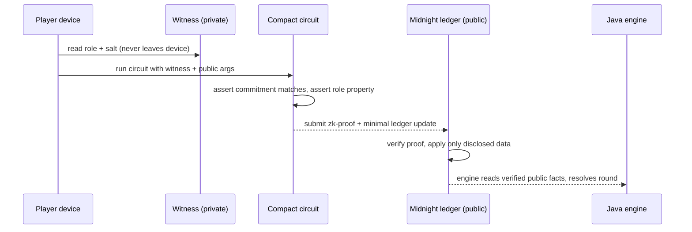

# Midnight Confidential Layer — Design

How Veil Protocol keeps confidential state (roles, targets, investigation results) private
and tamper-proof using **Midnight** ZK contracts, and how that bridges to the Java engine.

## Why Midnight

The Java `game-engine` already separates `PublicState` from `PrivateState` and hides everything
behind a redaction boundary — but that trust rests entirely on the **server**. Midnight removes
that trust assumption: confidential moves become **zero-knowledge proofs** the whole network can
verify without anyone (including the server) ever seeing the secret.

## The three-part mapping

| Concern | Java engine | Midnight (Compact) |
|---|---|---|
| Public, broadcast-safe | `state/PublicState` | `export ledger` (commitments, disclosed facts) |
| Confidential | `state/PrivateState`, roles on `Player` | `witness` callbacks (role + salt), off-chain |
| Trusted resolution | `GameResolver.execute()` | `export circuit` (+ zk-proof) |

## Core cryptography: commitments

Each player commits to their role once:

```
commitment = persistentHash([role, salt])   // salt = random 256-bit blinding factor
```

- **Hiding**: only the hash is on-chain; the role (4 possible values) can't be brute-forced
  because the 256-bit `salt` is secret.
- **Binding**: a player can't later prove a different role — the commitment wouldn't match.

## Circuits (see `midnight-contracts/src/contracts/*.compact`)

- **registerRole** — publish only the commitment.
- **proveCityMembership** — prove `role ∈ {Oracle, Aegis, Citizen}` without revealing which; leaks
  one bit ("CITY"). Backs city-only actions/votes.
- **submitShadowAttack** — prove a committed **Shadow** authorized an attack; the ledger stores
  only an opaque `hash(target, nonce)`. Mirrors `AttackAction.validate`.
- **proveInvestigation** — selective disclosure: prove a target's committed role, reveal **only**
  its faction bit. Mirrors `InvestigateAction`.

## Data flow (confidential night action)



## Bridge to the engine

- The engine remains the **real-time authority** (phases, timers, event stream).
- Midnight is the **settlement/verification layer** for moves that must be trustless.
- Engine `PrivateState` ⇄ Compact witnesses; engine `PublicState` ⇄ Compact ledger; the engine
  reads back only verified, disclosed facts (e.g. an investigation's faction bit).

## Running it

The runnable demo (`midnight-contracts/`) simulates the ZK step so it runs with no toolchain:

```bash
cd midnight-contracts && node src/demo.ts
```

To deploy for real: compile the `.compact` files with `compactc`, run the Midnight proof server
(Docker, wire into `docker-compose.yml`), and submit circuits via `midnight.js`. The demo's
boolean `valid` becomes a real zk-SNARK checked by the network.
